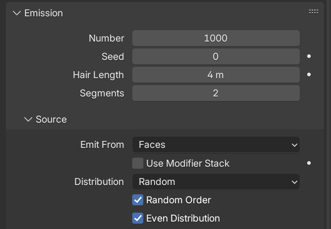

# MetaInstancer-Blender
This Addon can Import and Export MTI data for Hedgehog Engine 1.
> [!NOTE]
> This Addon is NOT perfect at the moment so
> - There are some issues with exporting rotations. 
> - The Import function is practically useless.

## To Do
- Add Cloud Instance Support

## Basic Setup Guide
### Scene Setup
To begin, make a surface which has a Particle System set on it. 
Use these settings: 
 

For some added randomness, I personally prefer using the settings below. 
Take note here that "Hair Length" is 4 metres, ONLY USE THIS VALUE FOR PREVIEWING!!! 

### Painting
If you want more control over the placement you can add weight paints to the Particle Settings, follow below. 
"Group" being the vertex group I will be using to paint grass onto my surface 
 
 
Then you can just begin painting your canvas like so: 

### Exporting
Once you're ready to export, make sure to go back to your Particle Emission Settings and reduce the Hair Length to 0. 
Then go to File > Export > Meta Instancer (.mti) and finally name and export your MTI.